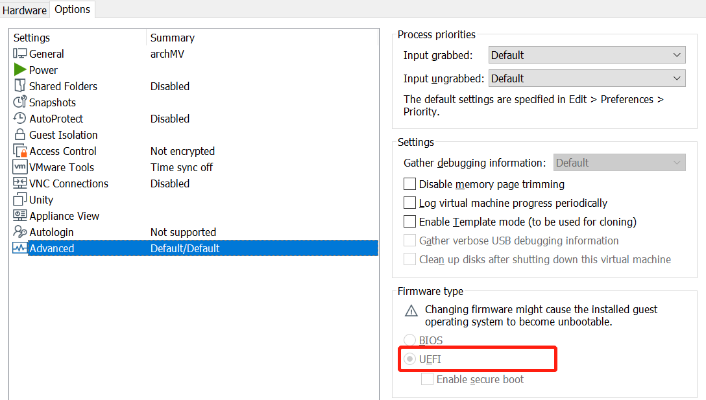

# Arch install in VMware

## pre-Installing
Your system should be `x86_64`.

Open UEFI mode

Be sure that you have opened the UEFI mode




Varify whether UEFI mode is enabled.

```bash
ls /sys/firmware/efi/efivars
```

Network check

````bash
ping www.archlinux.org
````


## Installing

Set tty font

```bash
setfont /usr/shar/kbd/consolefonts/...
```

Maybe `LatGrkCyr-12*22 ` or  `ter-u22b` is god

### system clock

Update the system clock

```bash
timedatectl set-ntp true
```


### disk partition

See the current disk for partition

```bash
lsblk #list block?
```

You will see `loop0` device and the disk which will likely be `sda`. `fdisk -l ` also will list the device.

In this example, we assume `sda` is the disk. The disk partition can be created by entering the following command.

```bash
cfdisk /dev/sda
```

`fdisk` can be used, but I think `cfdisk` is more convenient, since it is the graphic interface.

Select `gpt` and start our partitions. There are three important partitions:

1. EFI partition (sda1)
2. swap partition (sda2)
3. root partition (sda3)

Set `EFI partiton` size `512M` for the `grub`; Set `swap partition` `1-2G` for swap; Set leftover space for `root partition`.

You can also seperate other partitons, such as `home`. It is up to you.

Then, enter `Write` and `Quit` to comfirm your operation. Enter `lsblk` to varify whether it works.

Next we can set the partition format.

```bash
# EFI
mkfs.fat -F32 /dev/sda1 # boot: fast32
# swap
mkswap /dev/sda2
swapon /dev/sda2
# root
mkfs.ext4 /dev/sda3 # root disk: ext4
```

### disk mount

mount the important disks for further settings.

```bash
# root disk -> /mnt
mount /dev/sda3 /mnt
# EFI -> /mnt/boot/efi
mkdir /mnt/boot/efi
mount /dev/sda1 /mnt/boot/efi
```

### downloading some essentials

[arch linux mirror link](https://archlinux.org/mirrors/status/) to find more mirrors.

edit `/etc/pacman.d/mirrorlist` .

```bash
vim /etc/pacman.d/mirrorlist
```

Here are some mirrors in China.

```
Server = https://mirrors.sjtug.sjtu.edu.cn/archlinux/$repo/os/$arch
Server = https://mirrosr.tuna.tsinghua.edu.cn/archlinux/$repo/os/$arch
Server = http://mirrors.aliyun.com/archlinux/$repo/os/$arch
```

install the essential packages

```bash
pacstrap /mnt base linux linux-firmware
```

You can enter `linux-lts` instead of `linux` for Long Time Support kernel.

Then, we can generate `fstab` so that system can know where to mount the partitions after boots.

```bash
genfstab /mnt >> /mnt/etc/fstab
```

### root setting

Now that we can change root into our system.

```bash
arch-chroot /mnt
```

Customize the timezone.

```bash
ln -sf /usr/share/zoneinfo/Region/City /etc/localtime
```

set your `Region` and  `City`. For exampe, `ln -sf /usr/share/zoneinfo/Japan/Tokyo /etc/localtime`

Editor is neccessary. We can use `vim`. 

```bash
pacman -S vim
```

Next, edit the file `/etc/locale.gen` and uncommenting any locale you need. For example `en_US.UTF-8`. Generate the locales and set them.

```bash
vim /etc/locale.gen
# ... uncomment locales
locale-gen
echo "LANG=en_US.UTF-8" >> /etc/locale.conf
```

It is time to set our host name and hosts.

```bash
echo "archVM" >> /etc/hostname # you can set whatever name you want
vim /etc/hosts
```

Our entries would look like this.

```bash
127.0.0.1   localhost
::1         localhost
127.0.1.1   archVM.localdomain  archVM # set you host name
```

We can set root password and users.

```bash
passwd # set root password
# enter root's password
mkdir /home/username
useradd -d /home/username username
passwd username # set username password
# enter username's password
passwd -d username # you can empty username's password
```

If you are using an Intel processor, you should install Intel microcode.

```bash
pacman -S intel-ucode
```

### Network setting

The network is working now because of preconfiguired `systemd` networking services. We should configure networking services to promise the networking continue to work after VM reboots.

```bash
systemctl enable systemd-networkd
systemctl enable systemd-resolved
```

Show your network names.

```bash
ip addr
```

Aside from interface, you can see an additional one, in our case, `ens33`. Then, Edit the file `/etc/systemd/network/20-wired.network` and enter the following.

```
[Match]
Name=ens33

[Network]
DHCP=yes
```

### GRUB installation

We should install `grub` and `efibootmgr` for setting GRUB. In our case, we use UEFI, so we should install the second one.

```bash
pacman -S grub efibootmgr
```

Then, install the `grub bootloader` to `EFI parition`.

```bash
grub-install --target=x86_64-efi --efi-directory=/boot/efi --bootloader-id=GRUB
grub-mkconfig -o /boot/grub/grub.cfg
```

Reboot your system.

```bash
exit
umount -R /mnt
reboot
```

If there is no suitable font for you in `/usr/shar/kbd/consolefonts`, you can install font package

```bash
pacman -S terminus-font
```

And set your favourite font in `/etc/vconsole.conf`.

```bash
echo "FONT="ter-u22b"" >> /etc/vconsole.conf
```

## Desktop environment

### xfce4 installing

Here, we use `xfce4`

The following packages are required:

- [xorg](https://wiki.archlinux.org/index.php/Xorg): A package group that includes the `xorg-server` [display server](https://en.wikipedia.org/wiki/Display_server), a set of applications from `xorg-apps`, and fonts
- [lightdm](https://wiki.archlinux.org/index.php/LightDM): The [display manager](https://wiki.archlinux.org/index.php/Display_manager), provides a graphical user interface for log in
- [lightdm-gtk-greeter](https://wiki.archlinux.org/index.php/LightDM#Greeter): The default greeter for `lightdm`
- [xfce4](https://wiki.archlinux.org/index.php/Xfce): A package group that includes XFCE, the [desktop environment](https://wiki.archlinux.org/index.php/Desktop_environment), as well as supporting packages

```bash
pacman -S xorg xfce4 lightdm lightdm-gtk-greeter
```

After installation, enable the lightdm service to start at boot time:

```bash
systemctl enable lightdm
```

### dependencies for VM

- [gtk2](https://wiki.archlinux.org/index.php/VMware/Install_Arch_Linux_as_a_guest#Window_resolution_autofit_problems): Fit to window
- [gtkmm](https://wiki.archlinux.org/index.php/VMware/Install_Arch_Linux_as_a_guest#Window_resolution_autofit_problems): Fit to window
- [gtkmm3](https://wiki.archlinux.org/index.php/VMware/Install_Arch_Linux_as_a_guest#Drag_and_drop,_copy/paste): Copy and paste
- [xf86-input-vmmouse](https://wiki.archlinux.org/index.php/VMware/Install_Arch_Linux_as_a_guest#Xorg_configuration): Dependency of Xorg, mouse input tracking
- [xf86-video-vmware](https://wiki.archlinux.org/index.php/VMware/Install_Arch_Linux_as_a_guest#Xorg_configuration): Dependency of Xorg, fit to window
- [open-vm-tools](https://wiki.archlinux.org/index.php/VMware/Install_Arch_Linux_as_a_guest#Open-VM-Tools): Drivers/kernel modules and a service that enables communication between the host and guest systems; this package is required for both fit to window and copy and paste functions

Install the above packages with:

```bash
pacman -S gtk2 gtkmm gtkmm3 xf86-input-vmmouse xf86-video-vmware open-vm-tools
```

The VMware Tools service, vmtoolsd, needs to be configured to run at boot time. You can do this with the command:

```bash
systemctl enable vmtoolsd
```

update initramfs to include VMware modules in `/etc/mkinitcpio.conf`.

```
MODULES=(vsock vmw_vsock_vmci_transport vmw_balloon vmw_vmci vmwgfx)
```

After this edit, generate a new initramfs image with:

```bash
mkinitcpio -P
```

Reboot and verify os

```bash
reboot
```

